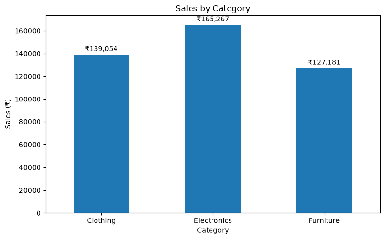
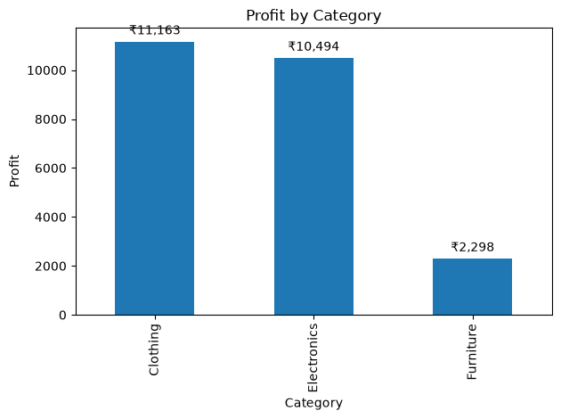
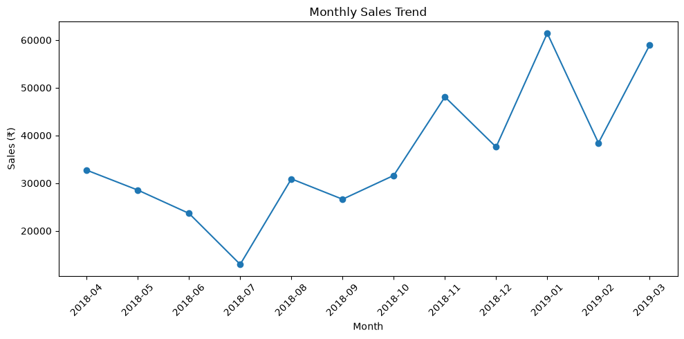
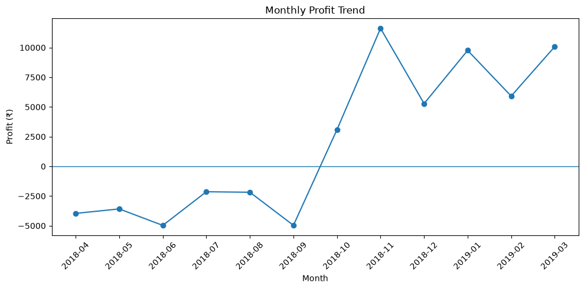
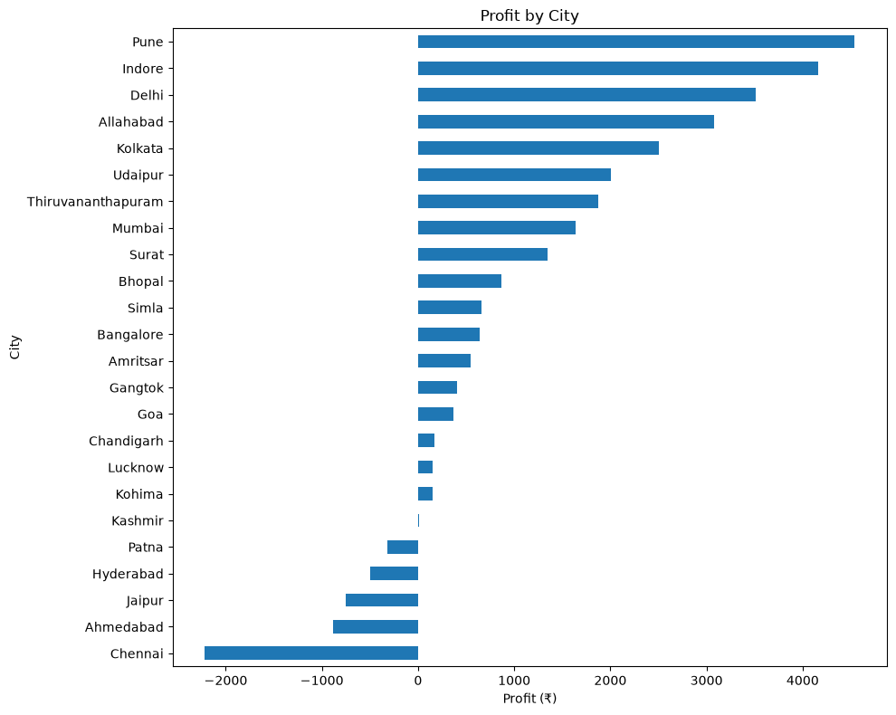
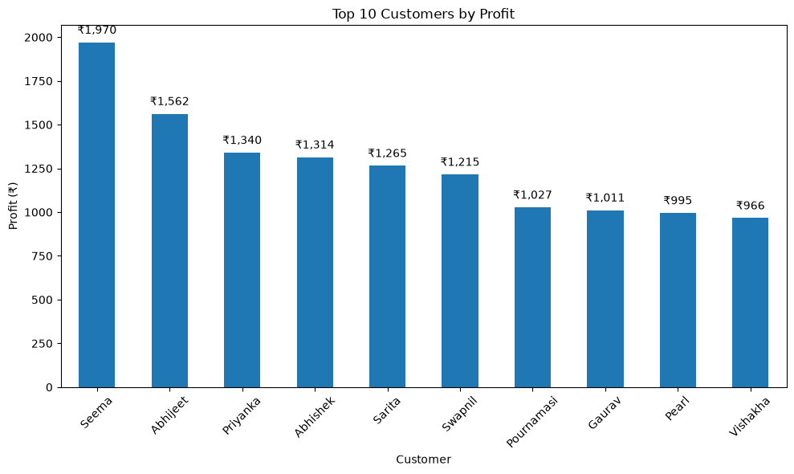
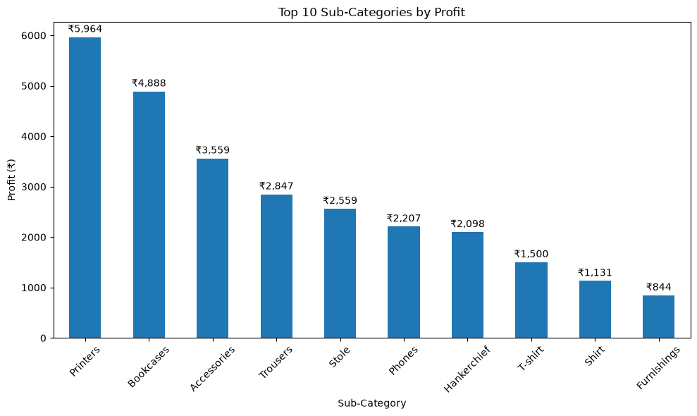
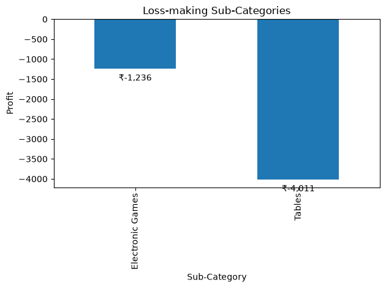
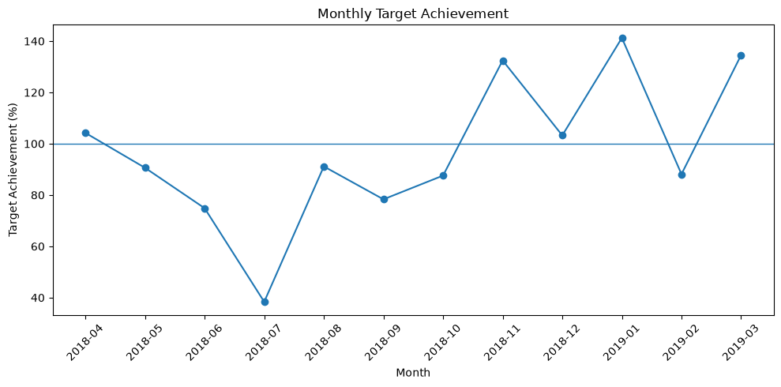

# E-Commerce Sales Analysis

## Project Overview

This project analyzes e-commerce sales data to understand sales performance, profitability, customer behavior, location-wise performance, monthly trends, and sales target achievement.

The analysis was performed using Python and Pandas, with Matplotlib used for data visualization.

## Tools & Technologies

- Python
- Pandas
- NumPy
- Matplotlib
- Seaborn
- SQL (Basic)

## Dataset

The dataset contains information about:

- Orders
- Customers
- States and cities
- Product categories and sub-categories
- Sales amount
- Quantity
- Profit
- Monthly sales targets

## Analysis Performed

### 1. Data Cleaning
- Removed completely empty rows
- Converted order dates into proper date format
- Converted target months into monthly periods
- Checked missing values and duplicate records

### 2. Overall Business Performance
Calculated:

- Total Sales
- Total Profit
- Total Quantity Sold
- Profit Margin

### 3. Category Analysis
Analyzed sales, profit, quantity, and profit margin for:

- Clothing
- Electronics
- Furniture

### 4. Sub-Category Analysis
Identified:

- Most profitable sub-categories
- Loss-making sub-categories
- Sub-categories with high sales but low profit

### 5. Location Analysis
Compared sales and profit across:

- States
- Cities

### 6. Monthly Analysis
Analyzed:

- Monthly sales
- Monthly profit
- Most profitable month
- Least profitable month

### 7. Sales Target Analysis
Compared actual monthly sales with sales targets and calculated target achievement percentages.

### 8. Customer Analysis
Analyzed:

- Top customers by sales
- Top customers by profit
- Customers with the highest number of orders
- Customers generating losses

## Visualizations

### Sales by Category



### Profit by Category



### Monthly Sales Trend



### Monthly Profit Trend



### Profit by City



### Top Customers by Profit



### Top Sub-Categories by Profit



### Loss-making Sub-Categories



### Monthly Target Achievement



## Key Business Insights

- Total Sales: **₹431,502**
- Total Profit: **₹23,955**
- Profit Margin: **5.55%**
- **Clothing** generated the highest profit among categories.
- **Furniture** was the weakest category in terms of profitability.
- **Tables** was the biggest loss-making sub-category.
- **Maharashtra** generated the highest state-level profit.
- **Tamil Nadu** had the lowest state-level profit.
- **Pune** was the most profitable city.
- **Chennai** had the lowest city-level profit.
- **November 2018** was the most profitable month.
- **June 2018** was the least profitable month.
- **January 2019** achieved the highest sales-target percentage at **141.24%**.

## Important Business Finding

Higher sales do not always mean higher profit.

Some products and customers generated significant sales but produced very low or negative profit. This shows why businesses should monitor **profitability and margins**, not just sales volume.

## Project Files

```text
E-Commerce-Sales-Analysis/
│
├── analysis.py
├── README.md
├── List of Orders.csv
├── Order Details.csv
├── Sales target.csv
└── .gitignore